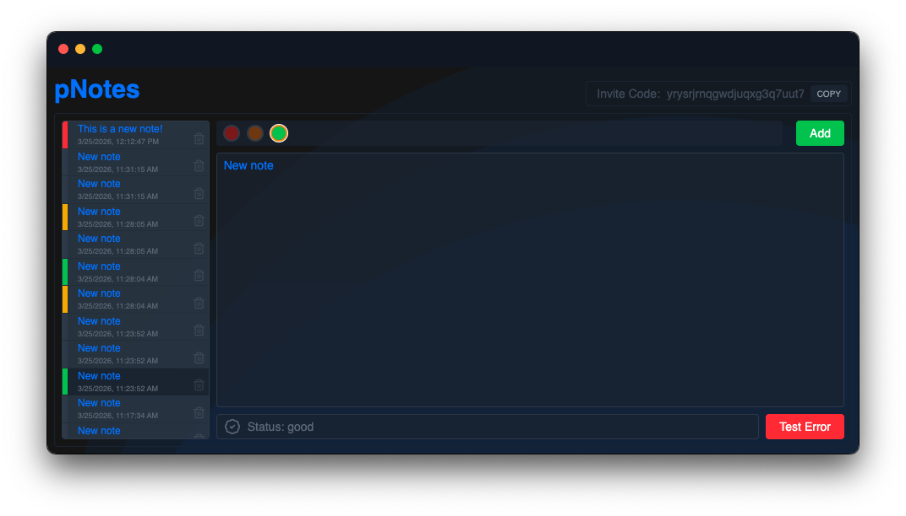

Pear Demo for Technical Review

---

Current seed link:

- pear://n6pdf45rmhdpsx7tquxcymweinbkquhoh4qkood4wxdmquq4zguy

Summary:

- This simple demo implements the Autobase api to create a simple notes interaction.

Features:

- start page allows create instance or join with invite code
- main panel shows invite key with copy button
- auto saving on note content change
- notes sorted by create/mod date
- ability to color code notes
- per note delete button with confirmation
- status bar footer which displays error messages when caught

Incomplete:

- pairing is mostly setup, but was finding challenges with testing with multiple instances locally. would value input from team to determine how to complete feature

Notes:

- I had intended to implement the UI with react, but ran into challenges setting up the backend api communication, so implemented with vanilla js to have a working demo to show.

AI Usage:

- ai assistant used for syntax reference, and troubleshooting pear ecosystem config issues
- ai used to generate tests and recommend worker.js structure to allow tests to target it
- genAi not used to generate core feature code for app

Pear Team:

- It was really fun (and a challenge) to work with the pear ecosystem, and look forward to working more with it in the future.

To run locally:

1. install pear runtime
2. navigate to project folder
3. from console run "pear run ."

To run tests:

1. in project root run "npm test"
